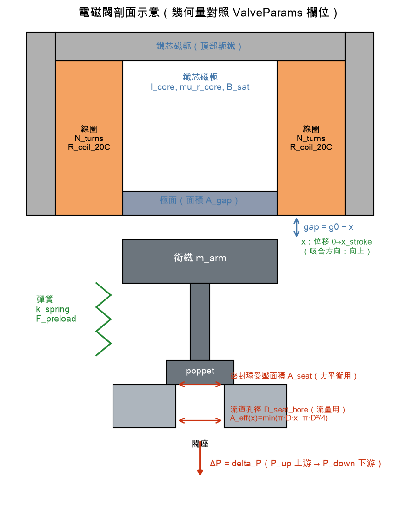
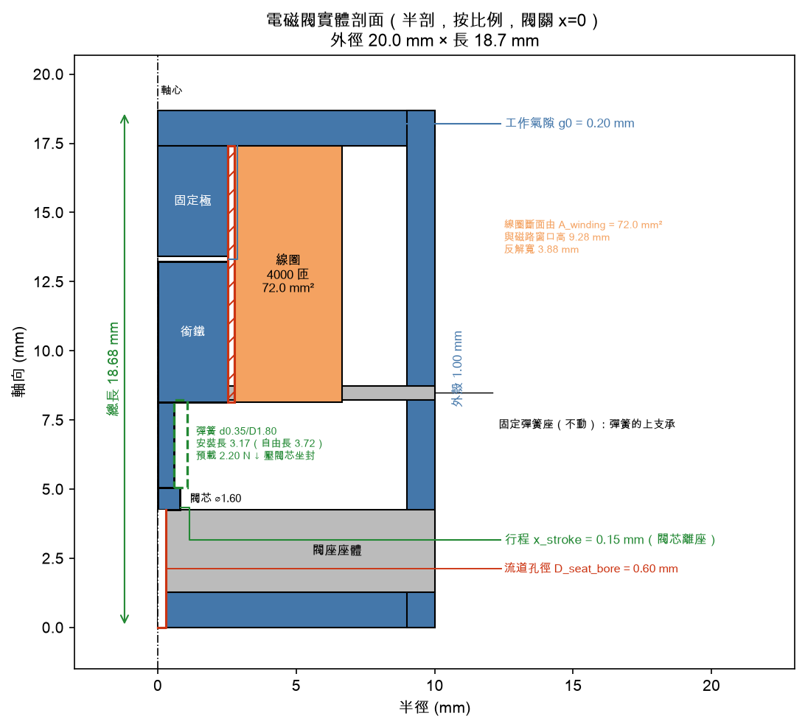

# PARAMS — 參數定義手冊

> 對照示意圖：
> （由 `solenoid_model/report/generate_schematic.py` 產生，修改參數定義時同步更新）

## ValveParams（閥件硬體，25 欄位）

### 電氣
| 欄位 | 中文 | 單位 | 定義 | 常見誤解 |
|---|---|---|---|---|
| `V_bus` | 供電電壓 | V | 線圈驅動電壓（衛星匯流排典型 22–36 V） | — |
| `R_coil_20C` | 線圈電阻（20°C） | Ω | 常溫線圈電阻；決定穩態電流 V/R 與 τ_e=L/R | R_coil_20C 是 20°C 參考值；乾跑模式(`T_coil=None`)仍視為定值。溫度相依電阻已由 P2 提供：傳入 `T_coil` 時模型改用 `thermal.R_coil(T)`（詳見下方「熱域參數(P2)」章節） |
| `N_turns` | 線圈匝數 | – | 繞線圈數；磁動勢 = N·i | 匝數↑力↑但電感也↑（τ_e 變長），非愈大愈好 |

### 磁路
| 欄位 | 中文 | 單位 | 定義 | 常見誤解 |
|---|---|---|---|---|
| `A_gap` | 磁極面面積 | m² | 氣隙磁通截面積，**磁路計算用** | ≠ A_seat ≠ 流道面積（見下方三面積辨析） |
| `g0` | 靜止氣隙 | m | 未通電時的磁氣隙 | `g0 ≥ x_stroke`；差值為殘餘氣隙（防磁滯黏著） |
| `x_stroke` | 行程 | m | 銜鐵從靜止到全開的位移 | 位移座標 x 由 0（閉）增加到 x_stroke（開）；`gap = g0 − x` |
| `l_core` | 鐵芯磁路長度 | m | 磁通在鐵芯內的路徑長度 | — |
| `mu_r_core` | 鐵芯相對導磁率 | – | 線性磁路假設下的固定值；亦是 `mag` 傳入 `AnalyticBH` 時的初始導磁率 | `mag=None`（預設）時未建模 B-H 飽和曲線，超過 B_sat 只警告不改結果；傳入 B-H 曲線（見下方「磁化模型（P8）」）才真的限制吸力 |
| `B_sat` | 飽和磁通密度 | T | 材料磁飽和上限（純鐵 ~2.15、Hiperco50 ~2.4、430F ~1.6） | `mag=None` 時僅用於警告旗標；傳入 B-H 曲線時是曲線本身的漸近上限 |

### 機械
| 欄位 | 中文 | 單位 | 定義 | 常見誤解 |
|---|---|---|---|---|
| `m_arm` | 銜鐵質量 | kg | 運動件總質量 | — |
| `k_spring` | 彈簧剛性 | N/m | 線性彈簧勁度 | — |
| `F_preload` | 彈簧預載力 | N | x=0 時彈簧已施之力 | 規格書寫法 `k·x₀` 與此等價：`x₀ = F_preload/k` 為預壓縮量 |

### 簡化負載
| 欄位 | 中文 | 單位 | 定義 | 常見誤解 |
|---|---|---|---|---|
| `delta_P` | 壓力差 | Pa | 跨閥座靜壓負載（簡化：定值）；**僅乾跑模式使用** | 耦合模式下被工況取代：靜壓力 = `(P_up−P_down)·A_seat`，此欄位被忽略（避免雙重帳本） |
| `A_seat` | 密封環受壓面積 | m² | 靜壓力 = delta_P × A_seat，**力平衡用** | ≠ 流道孔面積（見三面積辨析） |
| `damping_coeff` | 阻尼係數 | N·s/m | 黏滯阻尼佔位項 | ⚠️ 經驗簡化，非第一性推導；基準值 0.1 為假設 |

### 流道幾何（P1）
| 欄位 | 中文 | 單位 | 定義 | 常見誤解 |
|---|---|---|---|---|
| `D_seat_bore` | 閥座流道孔徑 | m | 決定流量的孔徑；`A_eff(x)=min(π·D·x, π·D²/4)` | 基準值 0.14 mm 由「全開 Cv≈0.0007，小推力等級姿控推力器閥」反推定案 |
| `C_d` | 流量係數 | – | ⚠️ **經驗係數**（銳緣孔口典型 0.6–0.9，預設 0.8），非第一性推導，實際值依幾何細節與 Re 數而異，精度約 ±15% | 不要與 Cv（閥容量係數）混淆。流體力（`flow_force_gas`/`flow_force_liquid`）亦透過 C_d 承接此不確定度，且**未含射流角 cosθ 修正**（銳緣閥座實驗值 ~69°），會高估關閉力 |

## ⚠️ 三個「面積/孔徑」辨析（最常見誤解）

| 量 | 用途 | 所在物理域 |
|---|---|---|
| `A_gap` | 磁通截面 → 磁阻、吸力 | 磁路（示意圖藍色） |
| `A_seat` | 靜壓作用面 → 壓力阻力 | 力平衡（示意圖紅色標註於密封環） |
| `D_seat_bore` | 流道孔 → A_eff(x)、Cv、ṁ | 流量（示意圖紅色標註於孔） |

三者數值互相獨立：基準案例 A_gap=30 mm²、A_seat=5 mm²、D_seat_bore=0.14 mm（孔面積僅 0.0154 mm²）。

**P6 新增的 `D_seal`（密封環等效直徑，`sealing.py` 用於接觸應力/洩漏率計算）不是第四個獨立量**，而是由 `A_seat` 導出：`D_seal = √(4·A_seat/π)`（即 `A_seat = (π/4)·D_seal²`），實作見 `sealing.seal_diameter(params)`。基準案例 `A_seat=5 mm²` → `D_seal≈2.523 mm`。這延續規格 §2.0 本體論「不得引入無法回溯的隱藏自由度」的原則：密封 land 寬度 `w_land`（見下方「密封與撞擊參數」章節）是疊加在既有 `A_seat` 力平衡面積上的幾何細節，而非另一個獨立面積輸入。

## 流體物性（fluid.py dataclasses）

| dataclass | 欄位 | 說明 |
|---|---|---|
| `GasProperties` | `gamma`, `R_specific` [J/(kg·K)] | 氣體身分常數 |
| `LiquidProperties` | `rho` [kg/m³], `c_sound` [m/s], `P_vap` [Pa] | 皆隨溫度變；預設常數標註對應溫度 |
| `FlowConditions` | `P_up`, `P_down` [Pa], `T0` [K] | 工況；T0 僅氣體分支使用 |

### 內建預設常數（工程物性表，約 3 位有效數字）

| 常數 | 值 | 來源溫度 |
|---|---|---|
| `N2` | γ=1.4, R=296.8 | 常溫理想氣體 |
| `XE` | γ=1.667, R=63.33 | 常溫理想氣體 |
| `HE` | γ=1.667, R=2077.1 | 常溫理想氣體 |
| `WATER_20C` | ρ=998.2, c=1482, P_vap=2339 Pa | 20°C |
| `LN2_77K` | ρ=806.1, c=850, P_vap=101325 Pa | 77.36 K（常壓沸點飽和態） |

hydrazine 未內建（音速等物性缺可靠來源），使用時自行以 `LiquidProperties(...)` 輸入並註明來源。

### 輸入域鉗位語意（P1，ODE 求解器安全）

`fluid.py` 對非法/邊界輸入採**鉗位**而非拋錯（ODE 求解器會探測 x<0 或瞬態壓力）：

| 輸入 | 語意 |
|---|---|
| `x < 0` | 視為 0 開度（閥全閉），`effective_area` 回傳 0 |
| `P_up ≤ 0` | 回傳 0 流量 / 0 力 |
| `P_down > P_up`（逆壓差）或零壓差 | 回傳 0 流量 / 0 力——**不模擬逆流** |
| `P_down < 0` | 視為 0（真空下限） |

### 閃蒸旗標的適用範圍

`flashing_risk` 用保守判準 `P_down ≤ P_vap`。注意縮流頸部（vena contracta）壓力比 P_down 更低，
所以**旗標未觸發不保證無空蝕**；精細判別（cavitation index 等）屬經驗模型，尚未實作。
LN₂ 這類貼沸點流體務必檢查此旗標。

## 熱域參數（P2）

線圈電阻的溫度效應（`thermal.R_coil`）採**分段模型**：

| 溫度域 | 模型 | 來源 |
|---|---|---|
| ≥ 233.15 K（−40°C，規格下限；線性式向上持續外推，無硬上限） | 線性 `R(T) = R_coil_20C·(1 + α·(T−293.15))`，α = 0.00393 /°C（銅，規格 §2.5） | 規格書；精度隨溫度升高下降，**473 K 以上僅供 `equilibrium_temp` 熱失控探測，不作定量判讀** |
| 77–233.15 K（低溫查表） | 分段線性 R/R₀ 表，錨點 233.15 K = 0.7642（與線性支在此無縫銜接） | 工程物性表，≈2 位有效數字 |
| < 77 K | 拋 `ValueError`（超出模型定義域） | — |

銅 R/R₀ 查表值：

| T (K) | R/R₀ |
|---|---|
| 77 | 0.13 |
| 100 | 0.21 |
| 150 | 0.41 |
| 200 | 0.62 |
| 233.15（線性錨點） | 0.7642 |

⚠️ 77 K 值受線材純度（RRR）影響，量級誤差 ±10%；查表適用域 77–473 K（上緣即線性支持續外推的軟上限）。

### 新增 `ValveParams` 欄位（皆為 EMPIRICAL 量級估計，非量測值）

| 欄位 | 中文 | 單位 | 定義 | 常見誤解 |
|---|---|---|---|---|
| `G_th_cond` | 傳導熱導 | W/K | 線圈到閥體安裝面的等效傳導熱導；用於 `thermal.equilibrium_temp` 的傳導項 | ⚠️ **EMPIRICAL**，30–500 g 級閥體的合理量級估計，非量測值；基準值 0.2 W/K 下平衡溫升（I=0.35 A、T_amb=293.15 K）≈ 57 K |
| `emissivity` | 表面輻射率 | – | 線圈外表面（封裝/氧化）輻射率，用於真空輻射項 | ⚠️ **EMPIRICAL**，典型封裝表面量級估計（0.8），非量測值 |
| `A_rad` | 輻射面積 | m² | 參與輻射散熱的線圈外表面積 | ⚠️ **EMPIRICAL**，30–500 g 級閥體量級估計（1.5e-3 m²），非量測值 |

### `equilibrium_temp`：定電流保守假設

`thermal.equilibrium_temp(I_hold, T_amb, params)` 解穩態平衡 `I²·R(T) = G_th_cond·(T−T_amb) + ε·σ·A_rad·(T⁴−T_amb⁴)`（真空：僅傳導+輻射，無對流）。

採**定電流**（而非定電壓）為保守假設：定電流下發熱功率 `I²R(T)` 隨 T 升高而增（銅電阻正溫度係數），有失控風險；定電壓下發熱功率 `V²/R(T)` 隨 T 升高反而下降，自帶穩定機制。若在 `T_max`（預設 1000 K）以下找不到平衡點，函式拋 `ValueError`（語意：此電流下持續保持會熱失控，而非計算錯誤）。

### 居里點

`thermal.curie_margin(T, T_curie=1043.15)` 為**檢查用**函式，回傳距居里點（軟鐵 ~770°C）的溫度餘裕，供使用者自行判讀，不影響模擬結果。B_sat 隨溫度的退化（居里點附近磁飽和急遽下降）**未建模**——`magnetics.py` 的 B_sat 為使用者輸入之固定值，與溫度無關。

## Flyback 電路參數（`flyback.py` dataclasses，P3）

| dataclass | 欄位 | 說明 |
|---|---|---|
| `DiodeFlyback` | `V_fwd` [V]（預設 0.7） | 二極體順向壓降簡化定值；⚠️ **EMPIRICAL**，非第一性推導，實際壓降隨電流呈 log 相依，此處採固定值簡化（與 `C_d` 相同處理方式） |
| `ZenerFlyback` | `V_clamp` [V]（預設 30.0） | 稽納鉗位電壓 |
| `RCFlyback` | `R_snub` [Ω]、`C_snub` [F]（無預設值，需自行指定） | RC 緩衝迴路；**無預設值**是刻意設計——見下方阻尼比限制 |

### RC 緩衝器的阻尼比限制

`RCFlyback` 與線圈電感 `L`、線圈電阻 `R_coil_20C` 構成二階 RLC 放電迴路，阻尼比：

```
ζ = (R_coil_20C + R_snub) / (2·√(L / C_snub))
```

若 `ζ < 1`（欠阻尼），電流會在衰減過程中反覆過零震盪，`dynamics.simulate_closing` 的「止擋釋放」判斷會因此語意不明確。這不是程式限制，而是真實工程限制——緩衝器本應設計成臨界阻尼（`ζ≈1`）或過阻尼（`ζ>1`）以抑制振鈴，欠阻尼參數組本來就不是合理的緩衝器設計。選用 `R_snub`/`C_snub` 時，建議先選定 `C_snub`，再以 `R_snub = ζ·2·√(L/C_snub) - R_coil_20C`（`ζ≥1`）反推 `R_snub`。基準參數組（`BASELINE_PARAMS`，全開氣隙電感 `L≈2.41 H`）在 `C_snub=1e-7 F`、`ζ=1.5` 下 `R_snub≈14656 Ω`。

## 繞線窗口參數（`winding.py`，P4）

線圈電阻由繞線幾何第一性推導（本體論原始項 1 的自由度：匝數、線徑、繞線窗口）：

```
R = ρ_cu · N² · l_turn_mean / (A_winding · k_fill)
```

模組常數 `RHO_CU_20C = 1.68e-8`（Ω·m，退火銅 20°C）。

### 新增 `ValveParams` 欄位（皆 EMPIRICAL 量級估計，帶預設值）

| 欄位 | 中文 | 單位 | 預設 | 常見誤解 |
|---|---|---|---|---|
| `l_turn_mean` | 平均每匝長度 | m | 0.031066 | ⚠️ EMPIRICAL，平均匝周長 = π × 平均匝直徑；平均匝直徑 = A_gap 圓極面直徑（6.18 mm）× 建構係數 1.6 = 9.89 mm → 周長 = π × 9.89 mm ≈ 31.07 mm；見 `winding_window_schematic.png` |
| `k_fill` | 填充係數 | – | 0.5 | 銅佔繞線窗口面積比例（典型 0.4–0.7）；⚠️ EMPIRICAL；見 `winding_window_schematic.png` |
| `A_winding` | 繞線窗口面積 | m² | 5.219e-5 | 與 `l_turn_mean`/`k_fill` **共同校準**，使 `winding.coil_resistance(N=2000)` 推出 R=80.0 Ω，與獨立輸入 `R_coil_20C` 一致（一致性檢查，非重定標）；對應線徑 0.129 mm（~AWG 36）；見 `winding_window_schematic.png` |

### 關鍵不變性與一致性設計

- **`N²/R` 不變性**：固定繞線窗口下 `N²/R = A_winding·k_fill/(ρ_cu·l_turn_mean)` 與 N 無關（基準組恆為 50000），這是 L2 功率–保持力斜率被窗口鎖定的物理根源。
- **一致性（非重定標）**：`R_coil_20C` 仍為 `dynamics` 使用的獨立 bit-frozen 輸入，不移除、不改值。繞線窗口參數為**分析層**（L2 用），校準成與之一致，使兩者是同一顆線圈。
- **溫度**：`ρ_cu` 用 20°C 定值；線圈電阻的溫度效應由 P2 `thermal.R_coil` 另行處理。

## L1 響應時間分解（`limits.py`，P4）

### τ_e 對匝數不變

固定繞線窗口下 `L ∝ N²`（`L = N²/ℛ`）且窗口推導的 `R ∝ N²`，故電氣時間常數

```
τ_e = L(gap)/R
```

**與匝數完全無關**（基準組：靜止氣隙 5.1999 ms、吸合氣隙 30.1593 ms，N 由 1000 至 8000 皆同）。這是 L2「`N²/R` 不變」的直接推論（而非姊妹結果）：`τ_e = L/R = (N²/R)/ℛ`——把 L2 已證明對匝數不變的 `N²/R` 再除以磁阻 ℛ，τ_e 自然也對匝數不變。**匝數不是響應速度的槓桿**，τ_e 的槓桿是窗口幾何與磁路。且 `i_ss = V/R ∝ 1/N²` 而 `dL/dx ∝ N²`，保持力 `∝ 1/N²`——固定窗口下增加匝數只會更慢更弱。

### 解析下限（`response_time_bound`）

由兩個各自樂觀的分量構成，故其和是**真正成立的下界**：

| 分量 | 式子 | 為何樂觀 |
|---|---|---|
| `t_i` | `−τ_e·ln(1 − i_th/i_ss)` | 忽略 back-EMF，而 back-EMF 只會讓電流上升更慢 |
| `t_x` | `√(2·m·x_stroke/F_max)` | 用全行程可得的最大力（B_sat 封頂）做等加速度行程 |

`i_th` = `motion_threshold_current`，即 `½i²|dL/dx|(g0)` 等於彈簧預載 + 靜壓時的電流（基準 0.19581 A）。實測在電壓／匝數／行程三組掃描共 18 個可吸合案例中 **100% 成立**（另 2 案例（N=4000 窗口一致、N=1000 固定電阻）根本吸不合，無界可驗），鬆緊度 `bound/t_open` = **0.796–0.913**。

`t_i` 在本模型內是**精確**的（`coupled_rhs` 在 `dv_dt > 0` 前把銜鐵鎖在 x=0，故前置期是 `L(g0)/R` 的純 RL 上升，恰在 `i = i_th` 結束）；`t_x` 才是樂觀的那一項，實測只回收真實行程時間的 6–26%。因此下界之所以緊（0.796–0.913），主要是因為本閥為**死時間主導**，並非等加速度行程模型準確。

### ⚠️ 規格的 `τ_e + √(2mx/F)` 不是界

規格 §3 L1 的分解式已實作為 `naive_response_time_estimate`，但**它不是界**——銜鐵在電流遠未穩定前就開始運動，把整個 τ_e 當前置延遲會重複計算。實測 `naive/t_open` 橫跨 **0.43–3.11**（低電壓低估、高電壓高估；行程掃描把上緣推到 3.11），兩邊都會跑。要引用「下限」請用 `response_time_bound`。

## L3 尺寸與可行域參數（`sizing.py`，P5）

### 新增 `ValveParams` 欄位（皆 EMPIRICAL，分析層專用，ODE 不使用）

| 欄位 | 中文 | 單位 | 預設 | 常見誤解 |
|---|---|---|---|---|
| `k_pack` | 封裝質量係數 | – | 3.0 | ⚠️ **EMPIRICAL**。`m_valve = m_active × k_pack`；基準 `m_active`=26.33 g × 3 = 79.0 g，落在規格 §4 的 30–500 g 內。不是推導值 |
| `J_max` | 電流密度上限 | A/m² | 20e6 | ⚠️ **EMPIRICAL** 連續工況上限（銅線典型 5–20 A/mm²）。基準閥實際為 26.82 A/mm²（脈衝工況），故基準在此上限下恰為臨界（`s*`=1.014） |

### 質量模型

```
m_active = A_gap·l_core·ρ_Fe + A_winding·l_turn_mean·ρ_Cu
m_valve  = m_active · k_pack
```

`ρ_Fe`=7870、`ρ_Cu`=8960 kg/m³（模組常數）。基準:鐵芯 11.80 g + 線圈 14.53 g = 26.33 g。質量隨尺度 `∝ D³`。

### 兩個封閉解極限

| 極限 | 式子 | 綁住 | 基準值 |
|---|---|---|---|
| 最小尺度 | `s* = B_sat·g0 / (μ₀·J_max·A_winding·k_fill)` | 尺度（與 ΔP 無關） | `J_max`=20 → 1.0140；30 → 0.6760 |
| 壓力上限 | `ΔP_max = B_sat²·A_gap / (2μ₀·A_seat)` | 壓力（與尺度無關） | 8.618 MPa（86.18 bar） |

兩者正交,故 (尺度, 壓力) 平面的可行域為**矩形**。這是尺寸判準本身的產物,而非獨立的物理結果:`min_feasible_scale` 要求繞組把氣隙打到**全飽和**,與閥實際要承受的 ΔP 無關(刻意取最惡劣情況),矩形正是這個與壓力無關的判準所致。若改採「按需匹配」判準(磁動勢只需在靜止氣隙撐住 `F_preload + ΔP·A_seat`,而非打到全飽和),`s*` 會隨 ΔP 變動(1 MPa 時 0.598、4 MPa 時 0.846、8 MPa 時 1.092),邊界也會變成曲線而非矩形;在基準 ΔP 下 `s* ≈ 0.72`,約為現行全飽和判準 1.014 的 1.4 分之一小。

### ⚠️ 規格點名的三個機制不產生小型化極限

規格 §3 L3 列的支配物理為「繞線窗口面積、磁飽和、閥座直徑與 ΔP 力」,但實測:所需閥座力與可得磁力**同為 `∝ D²`**,餘裕在任何尺度都恰為 **3.590933**;複用 P2 傳導+輻射熱模型反解各尺度容許電流後,磁動勢比值在 10 倍尺度內維持 1.478–1.511,亦未跌破 1。**故這三個機制單獨都給不出極限。**

該「無極限」結論其實是外推假象——反解出的電流密度爬到 299.72 A/mm²,遠超銅線可信範圍(基準已是 26.82)。真正的極限來自模型外的工程約束,本模型採 `J_max` 為之,並明確標註為 EMPIRICAL。

## 無量綱群與縮放律（`limits.dimensionless_groups`，P5）

| 群 | 定義 | 基準值 | 縮放律 |
|---|---|---|---|
| π₁ 行程/氣隙 | `x_stroke/g0` | 0.8571 | 不變 |
| π₂ 時間常數比 | `τ_e/τ_m` | 23.2546 | **∝ D** |
| π₃ 磁力數 | `F_mag/F_spring` | 4.3930 | 不變 |
| π₄ 壓力負載 | `ΔP·A_seat/F_spring` | 0.7500 | 不變 |
| π₅ 飽和餘裕 | `F_sat/(ΔP·A_seat)` | 3.5909 | 不變 |

自相似縮放下 `τ_e ∝ D²`、`τ_m ∝ D`(實測 `τ_e/s²`=5.19988 ms、`τ_m/s`=0.22361 ms 各尺度恆定),故 **π₂ 是唯一隨尺度變的群**。

**跨回合預測**:π₂ 由基準 23.25 在 s=0.2 時降到 4.65——縮小的閥會**從死時間主導轉為機械主導**。L1 解析下界之所以緊(0.796–0.913)正是因為基準閥死時間主導(`t_i` 佔 0.78–0.90),故該下界在小尺度應會變鬆。

## 密封與撞擊參數（`sealing.py`／`impact.py`，P6）

### 新增 `ValveParams` 欄位（皆 EMPIRICAL 幾何假設）

| 欄位 | 中文 | 單位 | 預設 | 常見誤解 |
|---|---|---|---|---|
| `w_land` | 密封 land 寬度 | m | 50 µm | ⚠️ **EMPIRICAL** 幾何假設，非量測值或最佳化結果。選 50 µm 是因為此寬度下 PCTFE/440C 軟閥座 `φ=0.555` 通過滲流門檻、17-4PH/440C 金屬對金屬 `φ=0.011` 遠不及——兩閥座恰落在門檻兩側，構成有意義的對照；見 `seal_land_schematic.png` |
| `R_tip` | 閥芯頭部曲率半徑 | m | 1 mm | ⚠️ **EMPIRICAL** 幾何假設，供 `impact.py` 的 Hertz 撞擊閉式解使用（接觸剛度 `k=(4/3)·E*·√R_tip`）；非量測值；見 `seal_land_schematic.png` |

比照 P5 的 `k_pack`/`J_max` 處理方式：`dynamics.simulate_opening`/`simulate_closing` 在 `seat=None`（預設）時完全不使用這兩個欄位，行為與 P0–P5 bit-level 相同；密封分析層（`sealing.*`、`limits.l4_leak_curve`/`l5_life_curve`）與傳入 `seat=SeatPair` 的回彈模式才會用到。`D_seal`（密封環等效直徑）由 `A_seat` 導出、不是獨立欄位，見上方「三個面積/孔徑辨析」章節。

### 滲流門檻與閥座組合（`sealing.py`）

密封判準採 Bowden-Tabor 全塑性接觸的實接觸面積分數 `φ = min(contact_stress/H, 1)`，達 `φ_c` 視為滲流（洩漏路徑被夾斷）：

```
phi_c = 0.42     # 二維連續滲流理論值；文獻實測 0.40-0.50，故標 EMPIRICAL
```

`materials.seat_pair()` 由兩個 `MaterialProperties` 組出 `sealing.SeatPair`：硬度 `H` 取較軟一方（它先降伏）、等效模數 `1/E* = (1-ν₁²)/E₁ + (1-ν₂²)/E₂`、粗糙度 `Rq_c = √(Rq₁²+Rq₂²)`。基準兩種閥座對照組：`PCTFE_ON_440C`（`E*`=1.696 GPa、`H`=0.10 GPa、`Rq_c`=0.412 µm、`e`=0.4）與 `METAL_17_4PH_ON_440C`（`E*`=107.364 GPa、`H`=4.0 GPa、`Rq_c`=0.141 µm、`e`=0.6，恢復係數皆 EMPIRICAL）。

⚠️ **洩漏分支的絕對值不可信**：殘留間隙的工程閉合式 `h = Rq_c·(1-φ)` 在 `p ≪ H` 時退化為 `h → Rq_c`，對載荷不敏感（基準金屬座 `w_land` 由 5 µm 拉到 200 µm，`h` 僅由 121.8 nm 動到 140.9 nm）。可信的僅是密封/不密封的門檻位置與所需 land 寬度上限（`sealing.land_width_for_seal`），詳見 `MODEL_NOTES.md`。

### `seat` 是第四個正交模式旋鈕

沿用 `medium`/`cond`、`T_coil` 建立的雙模式鐵律：`dynamics.simulate_opening`/`simulate_closing` 的 `seat=None`（預設）維持原止擋硬鉗制，對既有呼叫者 bit-level 不變；傳入 `sealing.SeatPair` 才於接觸事件 `v → -e·v` 反射後繼續積分回彈序列，以 `v_min`（預設 0.01 m/s）與 `n_max`（預設 50）雙重終止。`t_close`/`t_release` 語意不變（仍指首次觸座），回彈新增 `.bounce.t_settle`/`.bounce.n_bounce`/`.bounce.v_impacts`。

## 磁化模型參數（`magnetization.py`／`magnetics.py`，P8）

### `mag` 是第五個正交模式旋鈕

沿用 `medium`/`cond`、`T_coil`、`seat` 建立的雙模式鐵律：`magnetics.flux_density`／`magnetic_force_closing`／`saturation_check` 的 `mag=None`（預設）維持既有線性磁路（固定 `mu_r_core`），對既有呼叫者 bit-level 不變；傳入 `magnetization.AnalyticBH` 或 `TabulatedBH` 才切換到飽和磁路，由 `magnetics.solve_flux_density` 對 B 二分求解 MMF 平衡 `H(B)·l_core + B·gap/μ₀ = N·i`。`drive.py` 的 `current_for_force_margin`／`hold_current`／`pull_in_current`／`force_margin_at_current` 同步支援 `mag`：線性模式維持原封閉解，飽和模式改用 `scipy.optimize.brentq` 數值反解。

`AnalyticBH`（Fröhlich-Kennelly 解析式 `B(H) = μᵢH / (1 + μᵢH/B_sat)`）**不新增任何自由度**——兩個常數直接取自既有的 `mu_r_core`／`B_sat`，`magnetization.from_params(params)` 一行建構；`TabulatedBH` 供量測 (H, B) 點分段線性內插，超出量測範圍**鉗位而非外推**（外推 B-H 曲線會產生無界、不合物理的 B）。兩者刻意**不含磁滯**：單值曲線只模擬飽和，不模擬殘留磁化——對本閥而言這是對的取捨，氣隙主導的磁路殘留吸力僅 ~0.02 N，對比彈簧預載 2.2 N 差兩個數量級，不構成閥門卡死風險；換磁滯模型則會讓 ODE 從無記憶變成有磁化歷史相依，代價遠大於此處省下的精度。

### 線性模型在此閥有多不準

`N2_25BAR_PH_PARAMS`（見 `cases.py`）在閉合氣隙、峰值電流下：線性模式報 B=8.16 T（遠超任何真實鐵磁材料，不合物理）；换上 `AnalyticBH` 後為 2.03 T。沿整個行程比較吸力：線性模式從 44.58 N 暴增到 530.30 N（近 12 倍，形狀是「氣隙關閉、吸力失控」）；飽和模式僅從 26.47 N 升到 32.70 N（+24%）。「吸力隨氣隙關閉暴增」是線性模型的假象，不是閥的真實行為。

⚠️ **`cases.py` 與既有各報告（P0–P7）的裕度數字皆在 `mag=None` 線性模式下產生，未以飽和模型重算**——包含 `N2_25BAR_PH` 案例本身：其 `i_hold` 是用線性 `drive.hold_current` 解出、宣稱 2.0× 保持裕度，但以 `mag` 重新讀出的真實裕度僅 **1.60×**；要達到真 2.0× 需 13.07 mA（非既有的 11.44 mA），保持功耗隨之從 0.0368 W 升到 0.0481 W。引用任何既有裕度數字前，先確認該計算是否傳了 `mag`。

## 實體佈局參數（`layout.py`，P8）

> 對照圖：（由 `solenoid_model/report/generate_layout.py` 的 `generate_section()` 產生，按真實 mm 比例繪製，修改尺寸鏈時同步更新；另有 `layout_architecture.png` 為四物理域架構示意）

`layout.py` 是第 2 層的純代數分支（不 import `dynamics`/`magnetics`/`fluid`），把 `ValveParams` 已有的欄位推導成一條可製造的軸向尺寸鏈與外殼壁厚。核心區分是 **DERIVED vs EMPIRICAL**：磁軛截面、壁厚、彈簧幾何、銜鐵厚度皆由既有物理欄位算出；閥座座體與固定極厚度算不出來，是封裝判斷，集中宣告在模組常數 `LAYOUT_EMPIRICAL`，不埋在函式預設值裡。

### `LAYOUT_EMPIRICAL` 各項物理意義

| 鍵 | 值 | 物理意義 |
|---|---|---|
| `t_seat_body` | 3.0 mm | 閥座座體厚度：容納流道孔、密封 land 與閥座壓入配合的最小厚度；無一致性檢查可攔截，須由 CAD 階段回頭確認 |
| `t_fixed_pole` | 4.0 mm | 固定極厚度：需容納磁通轉向與繞線骨架端面支撐；本模型未解 3D 磁通分佈，厚度不足會在極面根部先飽和，故取封裝經驗值 |
| `t_manufacturing` | 1.0 mm | 外殼壁厚的可加工與剛性下限；本閥的磁性下限（0.35 mm）與結構下限（0.33–0.44 mm）皆遠低於此，故外殼壁厚實際由此項決定，不是由物理決定 |
| `t_sleeve` | 0.25 mm | 濕式銜鐵的非磁性隔離套（316L）；25 bar 下結構只需 0.11 mm，餘為加工餘裕；⚠️ 此厚度落在徑向磁路上但 `magnetics.reluctance` 未建模，故實際吸力低於模型報告值（見 MODEL_NOTES.md P8 限制 1） |
| `clearance_spring` | 0.1 mm | 彈簧全壓縮時與腔壁的餘隙，避免併圈干涉 |

比照 P5 的 `k_pack`/`J_max`、P6 的 `w_land`/`R_tip` 處理方式：這些欄位只在呼叫 `layout.*` 時使用，`dynamics.simulate_opening`/`simulate_closing` 完全不碰，不影響既有 ODE 行為。

`SPRING_DESIGN`（模組常數，非 `LAYOUT_EMPIRICAL` 成員）是規格 §6 解出的彈簧設計點（線徑 0.35 mm、中徑 1.8 mm、302 不鏽鋼 G=79 GPa），**屬 DERIVED**：由既有 `k_spring`/`F_preload` 反解圈數與應力，不是額外的封裝猜測，這也是它不放進 `LAYOUT_EMPIRICAL` 的原因。

### 外殼壁厚：三下限取大者

`shell_wall_thickness` 回傳 `WallThickness`（`magnetic`／`structural`／`manufacturing`／`adopted`／`reason` 五欄），三個獨立下限：磁通連續性要求的磁性下限、內壓 hoop 應力要求的結構下限、`t_manufacturing` 的製造下限，取三者最大者。在 `N2_25BAR_PH` 案例上磁性 0.35 mm、結構 0.33 mm 皆低於製造下限 1.00 mm，故實際壁厚由製造決定——回傳三個數字而非只回傳贏家，正是為了讓這個結論可見。

### 整閥包絡

`layout.envelope(params, coil_OD)` 給出外徑與總長。`N2_25BAR_PH` 案例：外徑 20.0 mm × 總長 18.679 mm。
